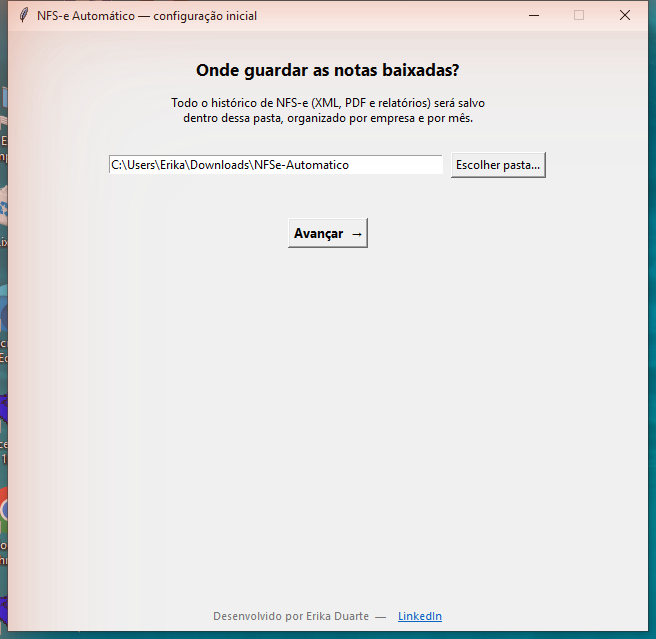
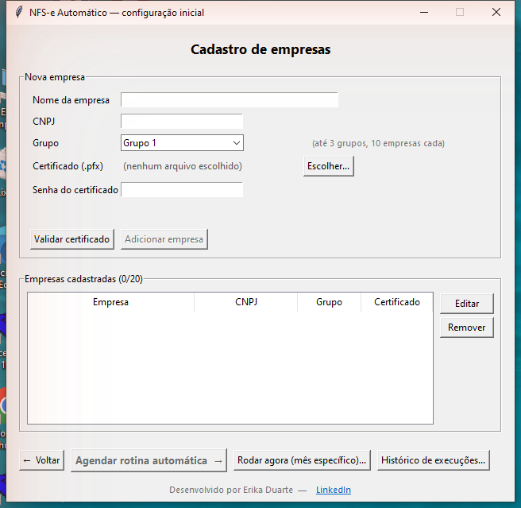
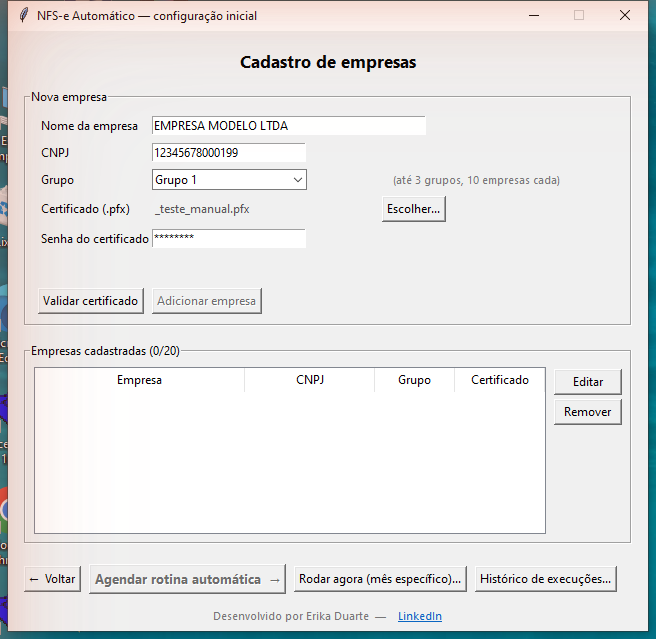
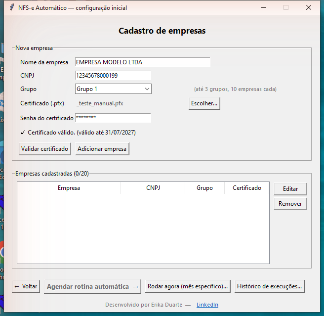
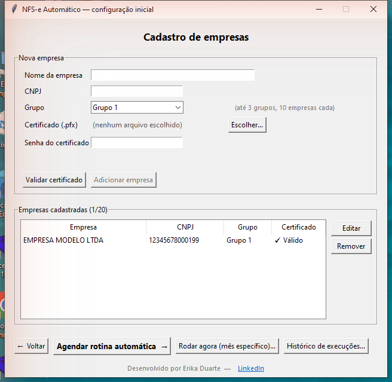
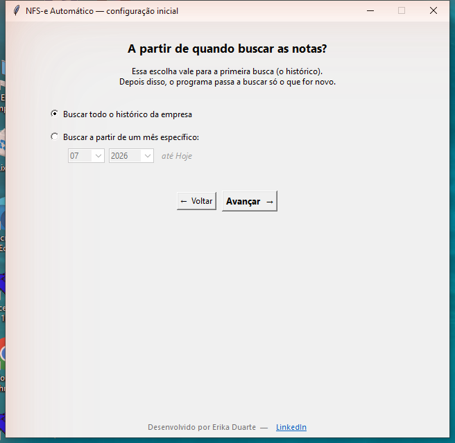
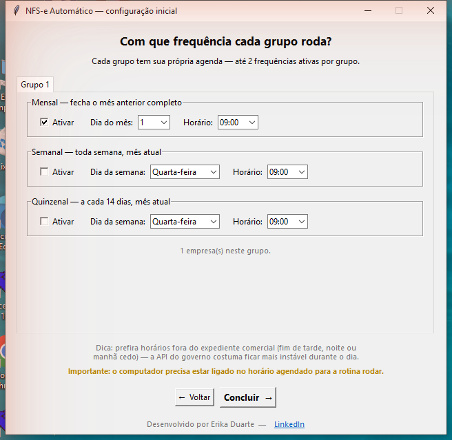
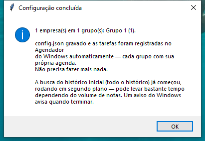
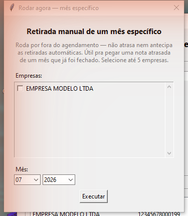
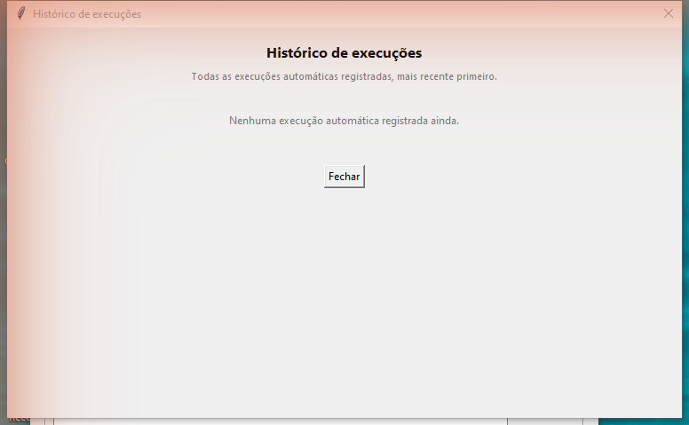

# NFS-e Automático — Manual de utilização

Ferramenta gratuita para baixar automaticamente as notas fiscais de serviço (NFS-e) da sua empresa direto do Portal Nacional, gerar relatórios em Excel e PDF, e rodar sozinha no dia e horário que você escolher.

*Desenvolvido por Erika Duarte*

---

## 1. O que você vai precisar

Antes de começar, separe:

- Um certificado digital A1 (arquivo `.pfx` ou `.p12`) da empresa — emitido por uma Autoridade Certificadora (Serasa, Certisign, Soluti, etc.). O certificado A3 (cartão/token físico) não funciona aqui.
- A senha desse certificado.

Não precisa saber programar nem instalar nada além do próprio programa — todo o resto é feito pelo assistente, respondendo poucas perguntas simples.

---

## 2. Instalando o programa

1. Baixe o arquivo `NFSe-Automatico.exe` (aba Releases do repositório).
2. Salve numa pasta fixa do computador (ex.: `Documentos\NFSe-Automatico`) — não rode direto da pasta de Downloads, para não se perder se organizar os arquivos depois. Não modifique nem exclua essa pasta.
3. Dê dois cliques no arquivo. Pronto, o assistente abre.

⚠️ **Importante:** o Windows pode mostrar um aviso do SmartScreen ("Windows protegeu seu PC"), porque o programa é novo e ainda não tem muitos downloads — é normal para programas independentes. Clique em **"Mais informações" → "Executar assim mesmo"**.

---

## 3. Primeira execução — onde guardar as notas

Na primeira vez que o programa abre, ele pergunta em qual pasta salvar tudo. Ali dentro ficará organizado por empresa e por mês: XML, PDF das notas e os relatórios gerados.

O programa já sugere uma pasta dentro de Downloads. Se quiser trocar, clique em **"Escolher pasta..."**. Depois, clique em **"Avançar"**.

*Essa tela só aparece nessa primeira vez. Da próxima vez que abrir o programa, ele já vai direto para a tela de cadastro de empresas.*

---

## 4. Cadastro de empresas

Aqui você cadastra cada empresa que o programa vai acompanhar — até 20 no total, organizadas em até 3 grupos (10 empresas por grupo).

Preencha:

- Nome da empresa
- CNPJ
- Grupo (Grupo 1, 2 ou 3 — cada grupo tem sua própria agenda, útil se quiser horários diferentes para conjuntos diferentes de empresas)
- Certificado (.pfx) — clique em "Escolher..." e selecione o arquivo
- Senha do certificado

### 4.1. Validando o certificado

Depois de preencher tudo, clique em **"Validar certificado"** antes de adicionar. O programa confere localmente (sem precisar de internet) se a senha está certa e mostra até quando o certificado vale.

### 4.2. Adicionando a empresa

Com o certificado validado, clique em **"Adicionar empresa"**. Ela aparece na lista "Empresas cadastradas", com a validade do certificado. Repita o processo para cada empresa que quiser cadastrar.

Dá para editar ou remover qualquer empresa da lista clicando nos botões **"Editar"** e **"Remover"**, ao lado da lista.

⚠️ **Importante:** cada empresa é salva assim que você clica em "Adicionar empresa" — não precisa chegar ao fim do assistente para não perder o que já foi cadastrado.

---

## 5. Período inicial (histórico)

Clique em **"Agendar rotina automática →"** para seguir. Aqui você escolhe: na primeira busca, o programa vai trazer todo o histórico da empresa, ou só a partir de um mês específico?

- **Buscar todo o histórico da empresa** — traz tudo que existir desde o início.
- **Buscar a partir de um mês específico** — você escolhe mês/ano; o programa busca desse mês até hoje.

*Essa escolha vale só para essa primeira busca. Depois disso, o programa passa a buscar automaticamente só o que for novo — não precisa mexer aqui de novo.*

---

## 6. Frequência da rotina automática

Clique em **"Avançar"** para chegar na tela de frequência. Aqui você define, para cada grupo, com que frequência o programa deve rodar sozinho — pode ativar até 2 frequências por grupo:

- **Mensal** — fecha o mês anterior completo. Escolha o dia do mês e o horário.
- **Semanal** — mantém o mês atual sempre atualizado, toda semana. Escolha o dia da semana e o horário.
- **Quinzenal** — como a semanal, mas a cada 14 dias em vez de toda semana.

⚠️ **Importante:** o computador precisa estar ligado no horário agendado para a rotina rodar. Se estiver desligado, ela roda assim que o PC ligar de novo (recuperação de atraso).

*Dica do próprio programa: prefira horários fora do expediente comercial (fim de tarde, noite ou manhã cedo) — a API do governo costuma ficar mais instável durante o dia.*

---

## 7. Concluindo a configuração

Clique em **"Concluir"**. O programa grava tudo em `config.json` e já cadastra sozinho as tarefas no Agendador do Windows — uma por grupo e por frequência ativada. Você não precisa abrir mais nada.

A partir daí, o programa roda por conta própria, nos dias e horários escolhidos. A busca do histórico inicial já começa em segundo plano assim que você conclui — pode levar bastante tempo dependendo do volume de notas, e um aviso do Windows avisa quando terminar.

---

## 8. Rodar agora (mês específico)

Reabra o programa a qualquer momento — ele leva direto para a tela de cadastro. O botão **"Rodar agora (mês específico)..."** dispara uma busca manual, sem esperar o horário agendado. Útil para pegar uma nota atrasada de um mês que já foi fechado, por exemplo.

Selecione até 5 empresas e o mês desejado, depois clique em **"Executar"**. Essa busca roda por fora do agendamento — não atrasa nem antecipa as retiradas automáticas.

---

## 9. Histórico de execuções

O botão **"Histórico de execuções..."**, ao lado de "Rodar agora", mostra todas as execuções automáticas já registradas (mais recente primeiro): data, hora, grupo, tipo de execução, competência, empresa e status (OK ou FALHOU).

Dá para exportar essa lista para Excel, com o botão correspondente na mesma tela.

---

## 10. Perguntas comuns

**"Certificado vencido" — o que faço?**
Renove o certificado com sua Autoridade Certificadora, ou remova a empresa do cadastro (reabra o programa para editar). Se não quiser mais ver esse aviso, marque "Não mostrar este aviso novamente" quando ele aparecer.

**Posso rodar o download manualmente, sem esperar o horário agendado?**
Sim — use o botão "Rodar agora (mês específico)..." na tela de cadastro (ver seção 8 deste manual).

**Onde ficam as notas e relatórios?**
Na pasta que você escolheu no Passo 1 (seção 3), organizados por empresa e por mês.

**O programa mexe em alguma coisa da minha conta do Governo/certificado?**
Não. Ele só lê as notas via API oficial do Portal Nacional, usando seu certificado para se autenticar — não emite, altera nem cancela nada.

**Por que só posso cadastrar até 20 empresas?**
Esse limite existe para não sobrecarregar a busca — rodar empresas demais ao mesmo tempo deixa o processo muito mais longo, mais sujeito à instabilidade do servidor do governo, e aumenta a chance de alguma etapa falhar por demorar demais. Se o seu escritório precisa de mais que isso, entre em contato.

**Apareceu um erro sobre "Tcl data directory" ao abrir o programa. O que é isso?**
Na grande maioria dos casos é o antivírus interferindo na extração temporária que o `.exe` faz toda vez que roda — comum em programas novos, sem assinatura digital de editora paga. Solução: adicione a pasta onde está o `NFSe-Automatico.exe` como exceção no seu antivírus (no Windows Defender: Configurações → Atualização e Segurança → Segurança do Windows → Proteção contra vírus e ameaças → Gerenciar configurações → Exclusões → Adicionar uma exclusão → Pasta).

---

*Desenvolvido por Erika Duarte*
